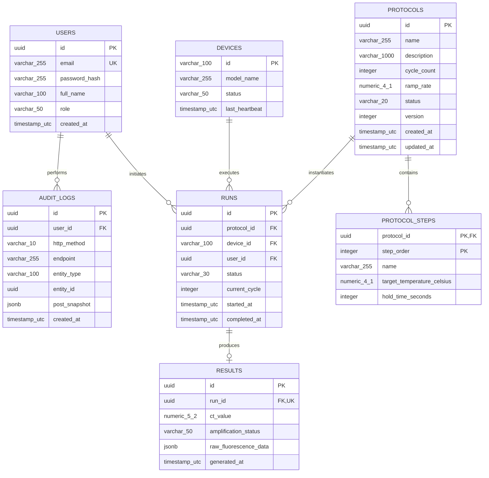

# Section B : Database Design (15 Marks)
## Sciverse PCR Protocol Management Service

This document presents the complete relational database architecture for the control plane system, covering all 6 mandatory domain modules: **Users**, **Devices**, **Protocols**, **Runs**, **Results**, and **Audit Logs**.

---

## 1. Entity-Relationship (ER) Diagram

---

## 2. Table Specifications, Constraints & Indexes

| Table Name | Primary Key | Foreign Keys & Target Table | Key Indexes | Business Constraints |
|---|---|---|---|---|
| `users` | `id` (UUID) | None | `idx_users_email` (UNIQUE) | `email` format validation, `role` IN (`ADMIN`, `LAB_TECH`) |
| `devices` | `id` (VARCHAR) | None | `idx_devices_status` | `status` IN (`IDLE`, `RUNNING`, `OFFLINE`) |
| `protocols` | `id` (UUID) | None | `idx_protocols_status_created` (`status`, `created_at DESC`) | `cycle_count` [1-60], `ramp_rate` [0.1-6.0] |
| `protocol_steps` | (`protocol_id`, `step_order`) | `protocol_id` $\rightarrow$ `protocols(id)` ON DELETE CASCADE | Primary Composite Index | `target_temperature_celsius` [4.0-99.0], `hold_time_seconds` [1-3600] |
| `runs` | `id` (UUID) | `protocol_id` $\rightarrow$ `protocols(id)`, `device_id` $\rightarrow$ `devices(id)`, `user_id` $\rightarrow$ `users(id)` | `idx_runs_device_status` (`device_id`, `status`), `idx_runs_started_at` (`started_at DESC`), `idx_runs_protocol_id` (`protocol_id`) | Partial UNIQUE index on `(device_id)` WHERE `status = 'IN_PROGRESS'` |
| `results` | `id` (UUID) | `run_id` $\rightarrow$ `runs(id)` ON DELETE CASCADE | `idx_results_run_id` (UNIQUE) | 1-to-1 strict mapping to `runs` |
| `audit_logs` | `id` (UUID) | `user_id` $\rightarrow$ `users(id)` | `idx_audit_entity` (`entity_type`, `entity_id`), `idx_audit_created` (`created_at DESC`) | Append-only security rule (no UPDATE or DELETE privileges granted) |

---

## 3. Evaluation Rubric Question Responses

### Question 1: Why did you choose this schema?
**Answer:**  
1. **Third Normal Form (3NF) & Step Decomposition:** The schema cleanly isolates protocol definitions from transient execution runs and analytical outputs. Protocols steps are normalized into an `@ElementCollection` table (`protocol_steps`) with a composite key `(protocol_id, step_order)`. This guarantees step ordering without requiring slow JSON text parsing or regex pattern matching inside SQL query predicates.
2. **Audit Integrity via Soft Deletes:** Protocols use soft deletion (`status = 'DELETED'`), preserving database foreign key pointers for historical `runs` and regulatory `audit_logs`.
3. **Concurrency Safety:** The `protocols.version` column leverages native JPA Optimistic Locking to prevent lost updates when multiple lab technicians edit protocols concurrently.

### Question 2: Which fields should be indexed?
**Answer:**  
- `protocols(status, created_at DESC)`: Directly powers paginated UI listing queries, filtering out `DELETED` protocols and retrieving the newest records first.
- `runs(device_id, status)`: Accelerates real-time device status lookups and prevents scheduling conflicts.
- `runs(started_at DESC)`: Essential for lab operations date-range reporting.
- `runs(device_id)` WHERE `status = 'IN_PROGRESS'`: A partial unique index that enforces at the database level that a physical instrument cannot run two protocols simultaneously.
- `audit_logs(entity_type, entity_id)`: Speeds up historical audit trail lookups for specific entities.

### Question 3: How will the schema perform with 5 million runs?
**Answer:**  
1. **B-Tree Index Efficiency:** Point lookups on `runs.id` (UUID) and composite queries on `(device_id, status)` will maintain logarithmic $O(\log N)$ B-Tree depth, resolving single-row queries in $< 2\text{ms}$ even with 5M rows.
2. **PostgreSQL Range Partitioning:** Range partition the `runs` table by `started_at` into monthly sub-tables (e.g., `runs_2026_07`). Queries targeting recent runs only scan the active monthly partition.
3. **Pagination & Archival Strategy:** Use cursor-based keyset pagination (`WHERE started_at < :last_seen_time ORDER BY started_at DESC LIMIT 20`) instead of expensive `OFFSET` scans. Historical partitions (> 1 year old) can be detached and archived to Amazon S3 / Parquet for cold storage.

---
*Return to [Root README](../README.md)*
