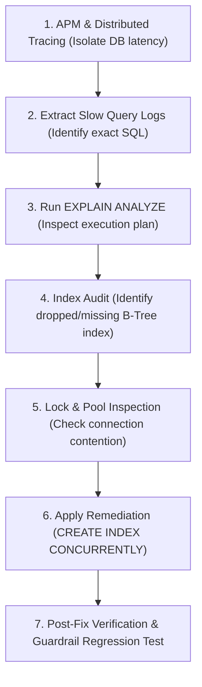
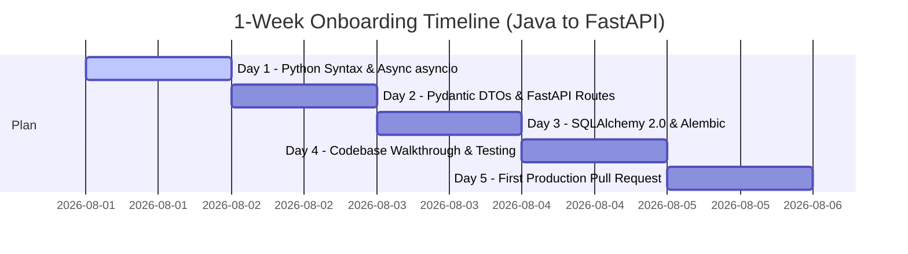
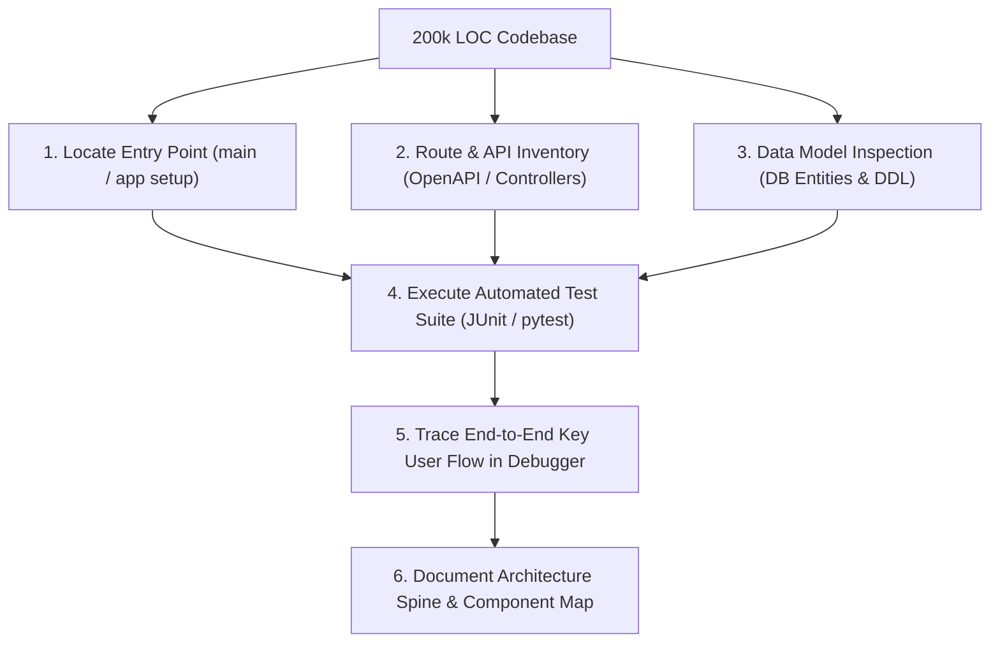

# Section F & G - Debugging, Code Review & Adaptability
## Sciverse PCR Protocol Management Service

This document covers **Section F (Debugging & Code Review - 10 Marks)** and **Section G (Learning & Adaptability - 10 Marks)**.

---

# Section F - Debugging & Code Review (10 Marks)

## F.1 Code Review of `create_user`

### Provided Code Snippet:
```python
def create_user(user):
    db.connect()
    db.insert(user)
    return True
```

---

### Comprehensive Flaw Identification

1. **Connection Leak Bug:** Opens a raw database connection via `db.connect()` on every function invocation without closing it in a `finally` block or context manager (`db.close()`). Under load, this exhausts the database connection pool in seconds.
2. **Missing Transaction Management:** Fails to manage transaction boundaries. It does not call `db.commit()` on success or `db.rollback()` on failure, risking uncommitted locks or half-written records.
3. **Absence of Exception & Error Handling:** If `db.insert()` fails (e.g. unique email constraint violation or database timeout), an unhandled exception crashes the execution thread and leaks raw database tracebacks.
4. **Security Vulnerability:** Accepting an unvalidated `user` object directly opens mass-assignment vulnerabilities and unparameterized SQL injection risks if `db.insert()` constructs raw SQL strings.
5. **Misleading Return Value:** Unconditionally returns `True` even if insertion failed silently or uncommitted data was discarded.

---

### Refactored Production Code

```python
import logging
from sqlalchemy.exc import IntegrityError, OperationalError
from db.session import SessionLocal
from schemas.user import UserCreateDTO, UserResponseDTO
from exceptions import DuplicateResourceException, DatabaseException

logger = logging.getLogger(__name__)

def create_user(user_data: UserCreateDTO) -> UserResponseDTO:
    """
    Creates a new system user safely using connection pooling, context cleanup,
    transaction handling, and explicit exception translation.
    """
    db = SessionLocal()  # Acquire connection from pool
    try:
        user = User(
            email=user_data.email.lower().strip(),
            password_hash=hash_password(user_data.password),
            full_name=user_data.full_name,
            role=user_data.role
        )
        db.add(user)
        db.commit()        # Atomic commit
        db.refresh(user)   # Load DB-generated fields (id, created_at)
        logger.info(f"Successfully created user id={user.id} email={user.email}")
        return UserResponseDTO.from_orm(user)
        
    except IntegrityError as e:
        db.rollback()      # Roll back failed transaction
        logger.warning(f"User creation failed: Duplicate email '{user_data.email}'")
        raise DuplicateResourceException("A user with this email address already exists.")
        
    except OperationalError as e:
        db.rollback()
        logger.error(f"Database connectivity error during user creation: {str(e)}", exc_info=True)
        raise DatabaseException("Database connection transient failure. Please retry.")
        
    except Exception as e:
        db.rollback()
        logger.error(f"Unexpected error creating user: {str(e)}", exc_info=True)
        raise DatabaseException("An internal error occurred while processing user creation.")
        
    finally:
        db.close()  # Guaranteed release back to connection pool
```

---

## F.2 Production Incident Debugging (120ms $\rightarrow$ 6s Degraded Latency)

### Incident Scenario
An API endpoint operating over an 8-million record database table degraded from a 120ms response time to 6 seconds.

### 7-Step Debugging Protocol



1. **APM & Distributed Tracing Inspection:** Inspect Datadog / Jaeger traces to verify whether latency is spent in application CPU serialization, network transit, or DB query execution.
2. **Extract Slow Query Logs:** Query PostgreSQL `pg_stat_statements` or MySQL slow query log to identify the exact SQL query text, parameters, and execution count.
3. **Run Execution Plan (`EXPLAIN ANALYZE`):** Execute `EXPLAIN (ANALYZE, BUFFERS)` on the query in a staging environment matching production volume.
   - Look for **Seq Scan** (Full Table Scan across 8M rows) versus **Index Scan**.
   - Check if `Buffers: shared read` indicates high disk I/O swapping.
4. **Identify Root Cause Candidates:**
   - **Missing Index on New Filter Column:** A recent code release added a `WHERE status = 'ACTIVE'` or `ORDER BY created_at` clause without a matching covering index.
   - **Index Marked Invalid / Unused:** A failed schema migration left an index in `INVALID` status.
   - **Implicit Type Casting:** A query parameter passed as `VARCHAR` when the column is `BIGINT` forces PostgreSQL to skip the index and execute a sequential table scan.
5. **Inspect Connection & Lock Contention:** Query `pg_stat_activity` to check if queries are waiting on row/table locks (`ExclusiveLock`) or experiencing connection pool starvation.
6. **Apply Production Fix:**
   - Build missing index concurrently without locking live table writes:  
     `CREATE INDEX CONCURRENTLY idx_runs_status_created ON runs(status, created_at DESC);`
   - Refresh table statistics: `ANALYZE runs;`
7. **Post-Fix Verification:** Verify latency metrics drop back $< 120\text{ms}$. Add a CI pipeline schema lint check to ensure all query `WHERE` parameters have corresponding indexes.

---

# Section G - Learning & Adaptability (10 Marks)

## Scenario 1: Java Spring Boot $\rightarrow$ Python FastAPI (1-Week Onboarding)



### Concept Mapping Reference Table
| Spring Boot (Java) | FastAPI (Python) | Conceptual Adaptation |
|---|---|---|
| `@RestController` / `@GetMapping` | `@app.get()` / `APIRouter` | Async controller routing (`async def`) |
| `@Valid` Jakarta Validation DTOs | `Pydantic BaseModel` | Automatic type validation & OpenAPI generation |
| Spring Data JPA / Hibernate | SQLAlchemy 2.0 / Alembic | Explicit ORM sessions and schema migrations |
| `@Autowired` / `@Component` | `Depends()` | Native functional dependency injection |
| JUnit 5 / Mockito | `pytest` / `pytest-mock` | Test fixtures and assertion framework |

---

## Scenario 2: Python $\rightarrow$ Go (6-Month High-Performance Service Strategy)

1. **Months 1-2 (Language Fundamentals & Typing):** Master strong static typing, explicit error handling (`if err != nil`), struct embedding, and implicit interface satisfaction.
2. **Months 3-4 (Concurrency Model):** Deep dive into **Communicating Sequential Processes (CSP)**: Goroutines, channels, buffered channels, `select` statements, `sync.Mutex`, and `sync.WaitGroup`. Understand memory allocation (heap vs stack escape analysis).
3. **Months 5-6 (Production Services & Tooling):** Build a high-performance TCP/MQTT ingestion service using `chi` router and `net/http`. Utilize `pprof` memory/CPU profiling to eliminate GC allocation bottlenecks.

---

## Scenario 3: Navigating a 200,000 LOC Unfamiliar Backend Codebase



1. **Top-Down Route & Boundary Mapping:** Locate application entry points and inspect REST/gRPC route manifests to understand all external interfaces.
2. **Data Entity Inspection:** Study database schemas and domain models (`domain/` directory) to learn core business domain nouns.
3. **Execute & Trace Automated Tests:** Run unit and integration test suites with step-by-step debugger breakpoints to trace execution flows.
4. **Log & Trace Exploration:** Trigger API endpoints in a dev environment and trace structured correlation IDs through service layers.

---
*Return to [Root README](../README.md)*
