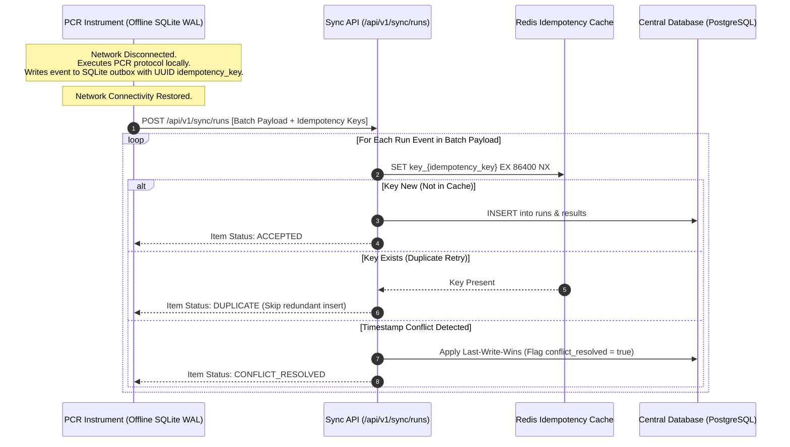

# Bonus Challenge — Offline-First Device Sync Architecture (+10 Marks)
## Sciverse PCR Protocol Management Service

This document details the architectural design for maintaining lab thermocycler instrument operation during internet connectivity outages, storing data locally on device, and synchronizing with central cloud databases once network connection is restored.

---

## 1. High-Level Architecture Sequence Diagram



---

## 2. On-Device Storage Strategy

- **Local Embedded Database:** Devices run an embedded **SQLite** database with Write-Ahead Logging (`PRAGMA journal_mode=WAL;`) enabled to prevent disk contention during high-frequency local writes.
- **Local Outbox Queue Table:**
  ```sql
  CREATE TABLE offline_run_queue (
      idempotency_key TEXT PRIMARY KEY,
      protocol_id TEXT NOT NULL,
      device_id TEXT NOT NULL,
      status TEXT NOT NULL,
      ct_value REAL,
      client_timestamp TEXT NOT NULL,
      sync_status TEXT DEFAULT 'PENDING',
      retry_count INTEGER DEFAULT 0
  );
  ```

---

## 3. Synchronization Protocol & API Spec

- **Endpoint:** `POST /api/v1/sync/runs`
- **Authentication:** Required (`Bearer JWT` or Device Mutual TLS Certificate)
- **Batch Processing:** Devices upload pending events in micro-batches of up to 50 items.
- **Request Payload:**
  ```json
  {
    "deviceId": "DEV-CYCLER-9082",
    "batchId": "a1b2c3d4-e5f6-7a8b-9c0d-1e2f3a4b5c6d",
    "events": [
      {
        "idempotencyKey": "9b1deb4d-3b7d-4bad-9bdd-2b0d7b3dcb6d",
        "protocolId": "e49c3391-c868-4c8e-b618-1f7f635f4de4",
        "status": "COMPLETED",
        "ctValue": 22.4,
        "clientTimestamp": "2026-07-31T01:10:00Z"
      }
    ]
  }
  ```

---

## 4. Conflict Resolution Strategy

1. **Idempotency Deduplication:** The server checks Redis using `SET key_{idempotencyKey} EX 86400 NX`. If the key exists, the item is acknowledged as `DUPLICATE` without re-executing database mutations.
2. **Last-Write-Wins (LWW) with Vector Versioning:** If a record for the same run exists:
   - Compare `clientTimestamp` against central DB `updated_at`.
   - If `clientTimestamp` is newer, update central DB and set `conflict_resolved = true`.
   - Record conflict resolution details in `audit_logs`.

---

## 5. Failure Recovery & Atomic Acknowledgements

- **Partial Batch Success:** The sync endpoint processes items independently and returns per-item status codes:
  ```json
  {
    "batchId": "a1b2c3d4-e5f6-7a8b-9c0d-1e2f3a4b5c6d",
    "processedCount": 2,
    "items": [
      { "idempotencyKey": "9b1deb4d-3b7d-4bad-9bdd-2b0d7b3dcb6d", "status": "ACCEPTED" },
      { "idempotencyKey": "4c2d3e4f-5a6b-7c8d-9e0f-1a2b3c4d5e6f", "status": "DUPLICATE" }
    ]
  }
  ```
- **Local Outbox Queue Purge:** The device purges local records only for items returning `ACCEPTED`, `DUPLICATE`, or `CONFLICT_RESOLVED`. Transient server errors (`REJECTED_500`) trigger exponential backoff retries.

---
*Return to [Root README](../README.md)*
