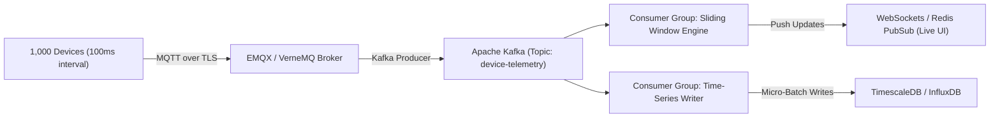

# Section D & E - Systems Architecture, Algorithms & IoT Communication
## Sciverse PCR Protocol Management Service

This document covers **Section D (Algorithms & Performance - 15 Marks)** and **Section E (Device Communication - 10 Marks)**. It addresses high-throughput telemetry ingestion, algorithmic complexity optimizations, and real-world IoT device protocol design.

---

# Section D - Algorithms & Performance

## D.1 Problem 1: High-Frequency Telemetry Ingestion (10,000 msgs/sec)

### Scenario Context
A fleet of **1,000 laboratory thermocycler instruments** sends telemetry data every **100 milliseconds**.  
Each telemetry message contains 5 payload fields: Temperature, Cycle Number, Motor Position, Pressure, Status.

### Total System Throughput Calculation
$$\text{Ingestion Rate} = 1,000 \text{ devices} \times 10 \text{ messages/sec/device} = 10,000 \text{ messages/second}$$

---

### Ingestion Data Plane Architecture

Directly attempting synchronous HTTP REST writes to PostgreSQL at 10,000 requests/second will exhaust database connection pools and disk write I/O within seconds. We separate the high-throughput **Data Plane** from the relational **Control Plane**:



### Data Structures & Memory Optimization
1. **LMAX Disruptor RingBuffer (Application Ingestion Layer):** Use a lock-free RingBuffer pre-allocated in heap memory. Ring buffers eliminate Java Garbage Collection (GC) pauses by reusing fixed memory slots for inbound telemetry frames.
2. **Sliding Window Ring Array:** Maintain a circular array buffer of size 100 per device to hold the last 10 seconds of raw telemetry ($10 \text{ samples/sec} \times 10 \text{ seconds} = 100 \text{ slots}$).

### Time Complexity & Memory Calculation
- **RingBuffer Write Complexity:** $O(1)$ lock-free CAS (Compare-And-Swap) operation per frame.
- **Sliding Window Read Complexity:** $O(1)$ direct array index lookup for UI live streaming.
- **Micro-Batch Write Complexity:** $O(K)$ amortized database write time, where $K = 5,000$ events per batch flush.
- **Payload Size:** Uncompressed JSON payload $= 128 \text{ bytes}$.
- **Ingestion Network Bandwidth:**  
  $$10,000 \text{ msg/sec} \times 128 \text{ bytes} = 1.28 \text{ MB/second}$$
- **Sliding Window Heap Memory Footprint:**  
  $$1,000 \text{ devices} \times 100 \text{ samples/device} \times 128 \text{ bytes} = 12.8 \text{ MB}$$  
  *(Extremely lightweight; easily runs in memory with negligible heap allocation).*

---

## D.2 Problem 2: Nested Loop Optimization ($O(N \times M)$ to $O(N+M)$)

### Original Slow Code Snippet:
```python
for protocol in protocols:
    for run in runs:
        if protocol.id == run.protocol_id:
            print(run)
```

---

### Complexity Analysis & Optimization Answers

#### 1. Time Complexity Analysis
- The nested loop compares every protocol ($N$) against every run ($M$).
- **Time Complexity:** $O(N \times M)$ quadratic time.
- **Impact:** If $N = 1,000$ protocols and $M = 100,000$ runs, total comparisons $= 10^8$ operations, causing severe API thread blocking and high CPU usage.
- **Auxiliary Space Complexity:** $O(1)$ constant space.

#### 2. Better Application-Level Solution ($O(N + M)$ Time)
Convert the `runs` collection into a Hash Map (Dictionary) keyed by `protocol_id`:
```python
from collections import defaultdict

# Step 1: Pre-group runs into Hash Map in O(M) time
runs_by_protocol = defaultdict(list)
for run in runs:
    runs_by_protocol[run.protocol_id].append(run)

# Step 2: Iterate protocols in O(N) time with O(1) hash lookups
for protocol in protocols:
    matching_runs = runs_by_protocol.get(protocol.id, [])
    for run in matching_runs:
        print(run)
```
- **Time Complexity:** $O(N + M)$ linear time.
- **Space Complexity:** $O(M)$ auxiliary memory for the hash table map pointers.

#### 3. Best Database-Level Solution
Delegate matching to PostgreSQL using indexed foreign key relational joins:
```sql
SELECT p.id AS protocol_id, r.id AS run_id, r.status, r.started_at
FROM protocols p
INNER JOIN runs r ON p.id = r.protocol_id
WHERE p.status = 'ACTIVE';
```
- Executed as an **Index Scan** or **Hash Join**, resolving in $O(N + M \log N)$ time without pulling millions of unneeded rows into application memory.

#### 4. Complexity & Memory Trade-Off Matrix

| Approach | Time Complexity | Memory Complexity | Scalability Assessment |
|---|---|---|---|
| **Nested Loop** | $O(N \times M)$ | $O(1)$ | Unusable in production (freezes server on medium datasets). |
| **Hash Map Grouping** | $O(N + M)$ | $O(M)$ | Excellent application speed; uses memory proportional to runs count. |
| **Indexed SQL JOIN** | $O(N + M \log N)$ | $O(\text{Page Size})$ | Optimal production standard (delegates join and memory pagination to SQL engine). |

---

# Section E - Device Communication (10 Marks)

| # | Topic / Question | Engineering Choice & Technical Rationale |
|---|---|---|
| 1 | **REST vs MQTT for Device Data** | **MQTT for Telemetry; REST for Control Plane.** MQTT (over TLS) is chosen for continuous 100ms telemetry due to its minimal 2-byte fixed header overhead (vs HTTP headers of ~500 bytes), publish-subscribe model, and low bandwidth footprint. REST is reserved for transactional control operations (Create Protocol, Start Run). |
| 2 | **WebSocket vs Polling for UI** | **WebSocket Streaming.** Polling 1,000 devices at 100ms intervals generates 10,000 HTTP connections/sec, causing severe CPU socket overhead. WebSockets provide persistent full-duplex TCP connections for streaming live temperature graphs to lab dashboards. |
| 3 | **Network Failure Reconnection** | **Exponential Backoff with Jitter.** When an instrument loses connectivity, the device agent attempts reconnects using $T = \min(T_{\max}, T_{\text{base}} \times 2^{\text{attempt}}) + \text{jitter}$. Unsent telemetry events are buffered locally in an on-device circular disk queue (SQLite WAL). |
| 4 | **Ensuring Message Ordering** | **MQTT QoS 1/2 + Monotonic Sequence Counters.** Every telemetry payload contains a device-side monotonically increasing `sequence_number` and UTC hardware timestamp. The server ingestion engine drops or re-sequences out-of-order packets using a re-sequencing window buffer. |
| 5 | **Preventing Duplicate Messages** | **Client-Assigned UUIDs + Redis Idempotency Cache.** Each telemetry frame and run command carries an `idempotency_key` (UUID v4). The API service performs an atomic `SET key val NX EX 86400` in Redis. Duplicate arrivals within TTL are acknowledged immediately without re-triggering logic. |
| 6 | **Telemetry Storage Engine** | **Time-Series Database (TimescaleDB / InfluxDB).** Telemetry is written to hypertables auto-partitioned by time and `device_id`, leveraging columnar compression (90%+ compression ratio). |
| 7 | **Permanent vs Ephemeral Storage Policy** | **Ephemeral:** Raw 100ms telemetry data is stored for 30 days, then down-sampled to 1-second aggregates before purging raw samples. **Permanent:** Protocol definitions, completed run summaries, final Ct results, audit logs, and hardware error codes are permanently retained for regulatory compliance. |

---
*Return to [Root README](../README.md)*
